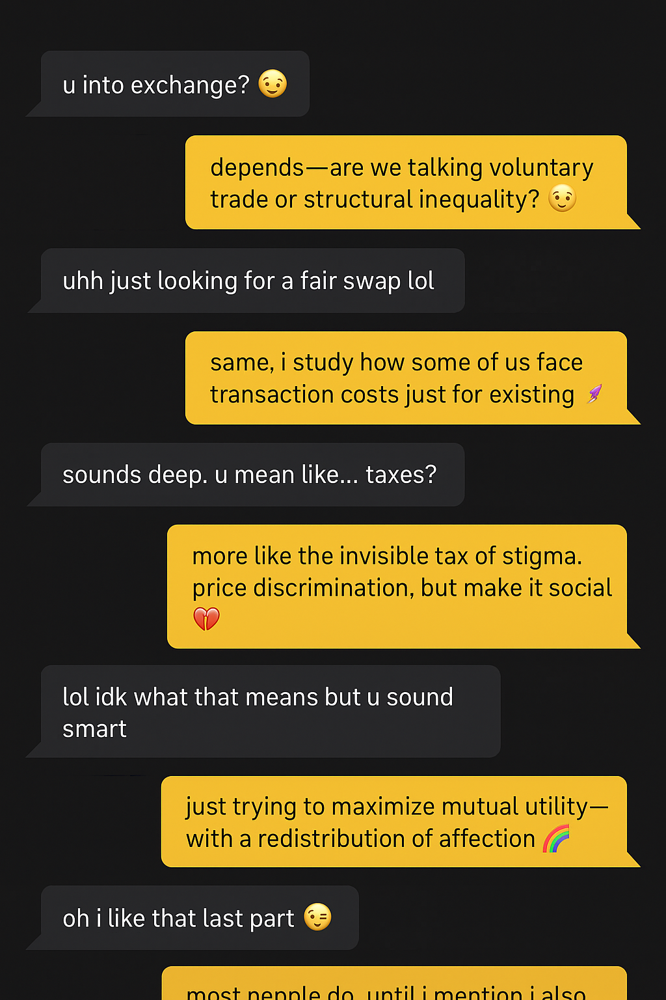

# Pro's academic page

{: .align-right width="300px"}

🙋I am a PhD candidate of Economics at CUNY's Graduate Center.

📊 My rseearch interests include Gender Economics, Labor Economics, Political Economy and International Development.

✍️ My current project examines the impact of stigma on marriage stability and asset ownership of same-sex couples.

👨‍🏫 I also teach undergraduate and Masters courses in Econometrics, Statistics, Microeconomics, Labor Economics and International Development.

I am a Ph.D. candidate in Economics at the Graduate Center, The City University of New York (CUNY), specializing in gender economics, labor economics, computational economics, and political economy. My research examines the intersections of stigma, inequality, and economic behavior—particularly for LGBTQ+ communities. My job market paper, “Stigma, Marriage Stability, and Wealth Accumulation of Same-Sex Couples in the U.S.”, develops a dynamic model of stigma in determining stability of same-sex marriages, and its impact on wealth inequality. Other projects explore algorithmic discrimination, the political economy of access to healthcare and homelessness among queer individuals. My work has been supported by the PATHS STEAM Educational Grant, Paul C. Notari Environmental Studies Grant, and Doctoral Student Research Grants from CUNY. I have taught at CUNY, Fordham University, and NYU, designing inclusive, data-driven economics curricula. I also serve on the Board of the Center for Lesbian and Gay Studies (CLAGS) and co-chairs QUNY, CUNY’s queer graduate organization.
